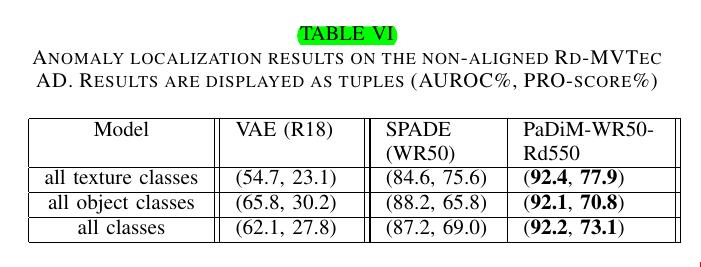

# Paper: PaDim (Patch Distribution Modeling) 

## Objective

- Identifies/localizes the anomaly in the images as shown in the images below

## Method

- This is the training part.
- Pass all the normal (without anomalies) training images through a pretrained CNN model like ResNet (pretrained on ImageNet)
- For each non-overlapping patch in the image, it takes the feature maps at different levels, concatenates them at channel level (by using the approach same as used in  Feature Pyramid), and then authors make assumption that this whole embedding is generated by Multivariate Gaussian Distribution G(𝝁ij, ∑ij) as shown in the last image whose process is explained in the subsequent steps. 

- (i,j) represents a particular patch position in the image and is described by a multivariate Gaussian distribution G(𝝁ij, ∑ij).
- Mean vector (𝝁ij) and Covariance matrix (∑ij) are calculated along the N rows ( since there are  N images)

- (∑ij)  is calculated by 

- 𝞮 is 0.01 and I is an Identity matrix. They are used for regularization.
- If the (𝝁ij) is of size (d,), then covariance matrix Σij is a Matrix of size d×d
    - It has inter-level correlation. It captures how each dimension of this vector varies with every other dimension (for patch (i,j))
- All the N images used here belong to normal class (0s) where there are no anomalies (also known as one-class setting).
- The dimension ‘d’ is a result of random sampling out of all the dimensions resulting after concatenation of feature maps at different levels.
    - Authors found random sampling performs better than reducing dimensions with PCA

## Inference
- For each patch (i,j) in the image
- Get the embedding vectors across multiple levels
- Calculate the Mahalanobis distance

- High score indicate the anomalous area
- The final anomaly score is the maximum of all the M(ij)

## Metrics
- AUROC
    - Where the TPR is % of pixels correctly classified as anomalous across the entire image
    - It is biased in favor of large anomalies.
- (PRO-score) Per region overlap
    - A connected component is a group of adjacent pixels labeled as "anomalous" (value = 1) that are touching each other — i.e., they form one continuous region.
    - For each connected component in an image:
        - Compute the TPR with respect to the Anamoly mask (In an anomaly mask, pixels are either 1 → anomalous OR 0 → normal based on a particular threshold value).
    - Calculate the mean of the TPR across all the connected components.
    - Calculate the FPR across the entire image
    - Plot the mean-TPR vs FPR by repeating this whole process for multiple thresholds [0.5, 1].
    - Calculate the area under the curve where FPR is between [0, 0.3]. Normalize this value (by dividing it by 0.3) to make it lie between [0,1].
    - A high PRO-score means that both large and small anomalies are well-localized

## Pretrained Models Used
- Resnet18
- Wide-Resnet50
- EffecientNet

## Datasets

- MVTec AD
    - 15 classes (same as shown in the objective section)
    - Training Data has normal images
    - Testing data contain anomalous images
- RD-MVTec AD
    - Applied random rotation (-10, 10) and random crop to MVTec AD
- STC
    - The ShanghaiTech Campus (STC) Dataset is primarily used for anomaly detection in the context of video surveillance

## Results
- Outperformed the State of the Art model 

## Glossary

- Why does the distribution have to be assumed coming from the multivariate gaussian distribution? Since we have already calculated the mean and the covariance, we could have just used them to calculate Mahalanobis distance and then evaluate whether it's an anomaly or not?
    - While it’s true that Mahalanobis distance could be used directly once we have the mean and covariance matrix, the assumption of a Gaussian distribution allows us to interpret the Mahalanobis distance in terms of probabilities.
    - Mahalanobis distance is a way of measuring how far a point (patch embedding in this case) is from the mean of the distribution, considering the covariance between the features. 
    - This Mahalanobis distance can be interpreted as the likelihood of the patch embedding being normal. A high Mahalanobis distance means the patch is less likely to be from the normal distribution
- TPR
    - TP/P
- FPR
    - FP/N
- Identity Matrix
    - 

- One-Class setting:
    - The one-class learning setting (also known as one-class classification or novelty detection) is a machine learning approach where the model is trained only on data from a single class, typically referred to as the "normal" or "positive" class. 
    - The goal is to learn the characteristics of this class well enough to detect whether new, unseen samples belong to the same class or are outliers/anomalies.
        - Key Characteristics: Training data: Contains only (or mostly) samples from one class.
        - Objective: Distinguish whether a new instance is similar to the training data (in-class) or not (out-of-class).
        - Used for: Anomaly detection, Fraud detection, Industrial fault detection, Novelty detection in images or texts

