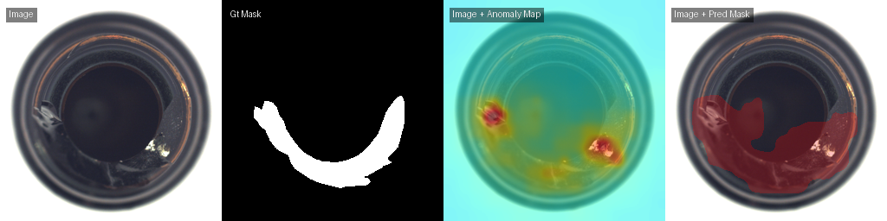

# PaDiM - Patch Distribution Modeling for Anomaly Detection

This directory contains an implementation of the **PaDiM (Patch Distribution Modeling)** algorithm for **image anomaly detection and localization**, adapted for category-wise training on the **MVTec AD** dataset.

  → [Paper](https://arxiv.org/abs/2011.08785)  
  → [Paper Summary](./PaperSummary.md)  

---

## Dataset: MVTec AD

* **Dataset**: [MVTec Anomaly Detection (MVTec AD)](https://www.mvtec.com/company/research/datasets/mvtec-ad)
* **Categories**: 15 industrial categories (e.g., bottle, capsule, carpet, etc.)
* **Task**: Visual anomaly detection and localization
* **Input**: High-resolution RGB images (256 X 256) of normal and anomalous industrial objects
* **Note**: Each category is trained **separately**.

---

## Model Details

* **Model**: PaDiM (Patch Distribution Modeling)
* **Backbone**: ResNet-18 / ResNet-50 (configurable)
* **Training Strategy**:

  * No fine-tuning or backpropagation. Use non-anomalous images only for training.
  * Uses pretrained ImageNet features
  * Concatenate the Features from multiple layers and randomly samples out of them.
  * Computes multivariate Gaussian distribution per patch location during training (from normal images)

* **Testing/Inference**:
  * Calculates Mahalanobis distance between test feature patch and the Gaussian model
  * Uses both good and anomalous images for testing

---

## Results

| Category     | image_AUROC | image_F1Score | pixel_AUROC | pixel_F1Score |
|--------------|-------------|----------------|--------------|----------------|
| bottle       | 1.00        | 0.98           | 0.98         | 0.70           |
| cable        | 0.82        | 0.82           | 0.95         | 0.40           |
| capsule      | 0.91        | 0.95           | 0.98         | 0.43           |
| carpet       | 0.98        | 0.96           | 0.99         | 0.56           |
| grid         | 0.80        | 0.86           | 0.94         | 0.28           |
| hazelnut     | 0.73        | 0.81           | 0.97         | 0.43           |
| leather      | 1.00        | 0.99           | 0.99         | 0.34           |
| metal_nut    | 0.96        | 0.95           | 0.95         | 0.68           |
| pill         | 0.90        | 0.94           | 0.96         | 0.55           |
| screw        | 0.78        | 0.88           | 0.98         | 0.18           |
| tile         | 0.95        | 0.92           | 0.91         | 0.48           |
| toothbrush   | 0.87        | 0.92           | 0.99         | 0.53           |
| transistor   | 0.87        | 0.76           | 0.97         | 0.61           |
| wood         | 0.98        | 0.95           | 0.93         | 0.42           |
| zipper       | 0.90        | 0.93           | 0.97         | 0.42           |

*Sharing Some Examples Below*

**Broken Bottle Cap**

**Carpet**

**Cracked Hazlenut**
